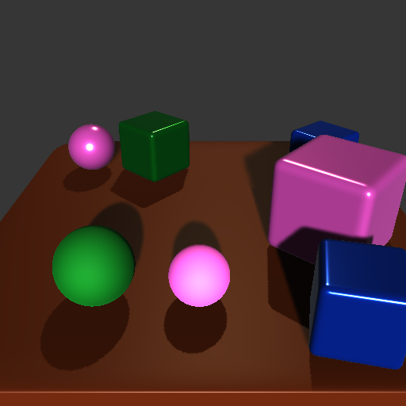
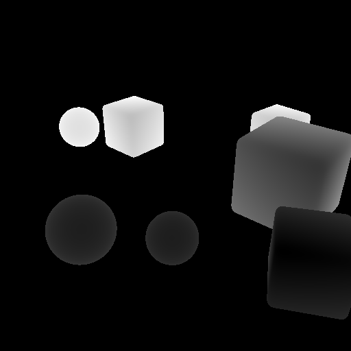
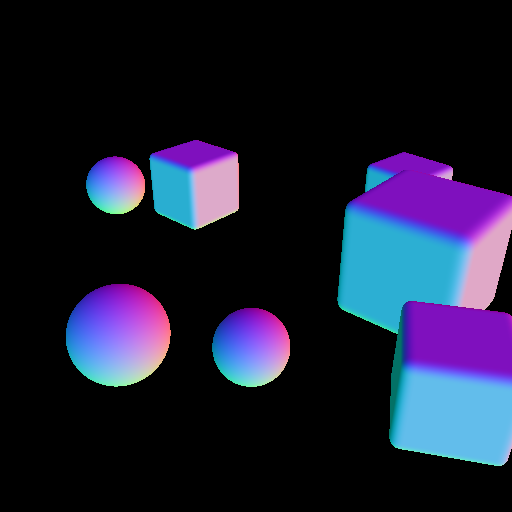
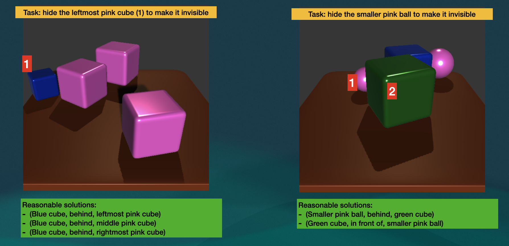

# Hide Project Update

A simple version of the **Dataset Generator(DG)** is setted down and available on the [github](https://github.com/akweury/hide_dataset_unity).

Each **scene** with the following data

- RGB image
- Depth Map
- Normal Map
- JSON File contains camera position & direction, object information(id, position, shape, size, material)

### Tasks

#### Hide objects
- Move objects to make target object completely(100%) invisible
- Move objects to make target object undetectable (not necessary 100% invisible)

#### Find objects
- Move objects to make target object mostly/completely visible;
- Move objects to make target object detectable.

### Modelling the world

- Target Format: 
  - 1-tuple: (Obj), e.g. (green ball)
- Solution Format:
  - 3-tuple: (Obj, Position, Obj), e.g. (green ball, behind, bigger pink cube),
  - (bigger pink cube, in front of, green ball)
- Position Domain:
  - {left, right, in front of, behind} 
- Object Domain:
  - {all the objects}

